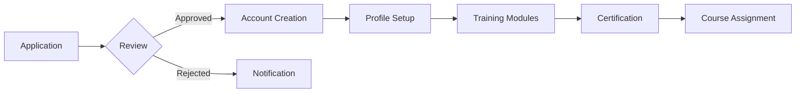

# Instructor & Admin Workflows Documentation

## Overview

This document outlines the complete workflows, permissions, and capabilities for instructors and administrators on the AiStudio555 AI Academy platform. It defines the user journeys, system interactions, and business processes for managing courses, students, and platform operations.

## User Roles & Permissions

### Role Hierarchy

```
┌─────────────────────────────────────────┐
│           SUPER ADMIN                   │
│  • Full system access                   │
│  • Platform configuration               │
│  • User role management                 │
└─────────────┬───────────────────────────┘
              │
    ┌─────────▼─────────┬─────────────────┐
    │      ADMIN        │   LEAD INSTRUCTOR│
    │  • User mgmt      │  • Course approval│
    │  • Finance        │  • Instructor mgmt │
    │  • Analytics      │  • Curriculum      │
    └─────────┬─────────┴────────┬────────┘
              │                   │
         ┌────▼────┐        ┌────▼────┐
         │SUPPORT  │        │INSTRUCTOR│
         │ • Tickets│        │ • Teaching│
         │ • Chat   │        │ • Grading │
         └─────────┘        └──────────┘
```

### Permission Matrix

| Feature | Super Admin | Admin | Lead Instructor | Instructor | Support |
|---------|------------|-------|-----------------|------------|---------|
| **User Management** |
| Create Users | ✅ | ✅ | ❌ | ❌ | ❌ |
| Edit Users | ✅ | ✅ | ❌ | ❌ | ❌ |
| Delete Users | ✅ | ⚠️ | ❌ | ❌ | ❌ |
| Assign Roles | ✅ | ⚠️ | ❌ | ❌ | ❌ |
| **Course Management** |
| Create Course | ✅ | ✅ | ✅ | ✅ | ❌ |
| Edit Any Course | ✅ | ✅ | ✅ | ❌ | ❌ |
| Edit Own Course | ✅ | ✅ | ✅ | ✅ | ❌ |
| Delete Course | ✅ | ✅ | ⚠️ | ❌ | ❌ |
| Publish Course | ✅ | ✅ | ✅ | ⚠️ | ❌ |
| **Student Management** |
| View All Students | ✅ | ✅ | ✅ | ⚠️ | ⚠️ |
| Grade Assignments | ✅ | ❌ | ✅ | ✅ | ❌ |
| Issue Certificates | ✅ | ✅ | ✅ | ⚠️ | ❌ |
| **Financial** |
| View Revenue | ✅ | ✅ | ⚠️ | ❌ | ❌ |
| Process Refunds | ✅ | ✅ | ❌ | ❌ | ❌ |
| Set Pricing | ✅ | ✅ | ❌ | ❌ | ❌ |
| **Support** |
| View Tickets | ✅ | ✅ | ⚠️ | ⚠️ | ✅ |
| Respond to Tickets | ✅ | ✅ | ⚠️ | ⚠️ | ✅ |
| Escalate Issues | ✅ | ✅ | ✅ | ✅ | ✅ |

Legend: ✅ Full Access | ⚠️ Limited Access | ❌ No Access

---

## Instructor Workflows

### 1. Instructor Onboarding



**Steps:**
1. **Application Submission**
   - Submit CV and portfolio
   - Complete teaching philosophy questionnaire
   - Provide references and credentials

2. **Review Process**
   - Admin reviews qualifications
   - Background check (if required)
   - Interview scheduling

3. **Account Setup**
   - Create instructor account
   - Assign appropriate permissions
   - Set up payment information

4. **Training**
   - Platform orientation (2 hours)
   - Teaching methodology training
   - Technology tools training
   - Quality standards review

5. **Certification**
   - Complete platform quiz
   - Submit sample lesson
   - Receive instructor badge

### 2. Course Creation Workflow

**Phase 1: Planning**
```
1. Market Research
   └── Analyze demand
   └── Review competition
   └── Define target audience

2. Course Proposal
   └── Title and description
   └── Learning objectives
   └── Duration and schedule
   └── Pricing recommendation

3. Approval Process
   └── Lead Instructor review
   └── Admin approval
   └── Marketing review
```

**Phase 2: Development**
```
4. Curriculum Design
   ├── Module structure
   ├── Lesson planning
   ├── Assignment creation
   └── Assessment design

5. Content Creation
   ├── Video recording
   ├── Slide preparation
   ├── Resource compilation
   └── Quiz development

6. Quality Review
   ├── Content accuracy
   ├── Production quality
   ├── Accessibility check
   └── Platform compliance
```

**Phase 3: Launch**
```
7. Course Setup
   ├── Upload content
   ├── Configure settings
   ├── Set prerequisites
   └── Define enrollment rules

8. Testing
   ├── Preview as student
   ├── Test all features
   ├── Verify payments
   └── Check certificates

9. Publication
   ├── Set live date
   ├── Marketing materials
   ├── Announcement
   └── Early bird promotion
```

### 3. Teaching Workflow

**Daily Activities:**

```typescript
interface InstructorDaily {
  morning: {
    checkNotifications: boolean;
    reviewSchedule: boolean;
    prepareClasses: boolean;
  };
  
  teaching: {
    conductLiveSession: boolean;
    recordSession: boolean;
    manageBreakoutRooms: boolean;
    answerQuestions: boolean;
  };
  
  afternoon: {
    gradeAssignments: boolean;
    provideFeedback: boolean;
    updateProgress: boolean;
    respondToMessages: boolean;
  };
  
  evening: {
    prepareNextDay: boolean;
    reviewAnalytics: boolean;
    updateContent: boolean;
  };
}
```

**Weekly Tasks:**
- Monday: Week planning and content review
- Tuesday-Thursday: Live sessions and grading
- Friday: Student consultations and catch-up
- Weekend: Content development and improvement

### 4. Student Interaction Workflow

**Communication Channels:**
1. **Live Classes**
   - Zoom integration
   - Interactive polls
   - Breakout rooms
   - Screen sharing

2. **Async Communication**
   - Discussion forums
   - Direct messages
   - Email notifications
   - Office hours

3. **Feedback Mechanisms**
   - Assignment comments
   - Video feedback
   - Rubric-based grading
   - Progress reports

### 5. Grading & Assessment Workflow

```
Assignment Submission
        ↓
    Auto-Check
   (Plagiarism)
        ↓
  Instructor Review
        ↓
   Provide Feedback
        ↓
    Assign Grade
        ↓
  Student Notification
        ↓
   Grade Appeal?
     ├── Yes → Review → Final Decision
     └── No → Record Final Grade
```

**Grading Standards:**
- **A (90-100%)**: Exceptional work
- **B (80-89%)**: Good understanding
- **C (70-79%)**: Satisfactory
- **D (60-69%)**: Needs improvement
- **F (<60%)**: Fail - requires retake

---

## Admin Workflows

### 1. Platform Administration

**Daily Operations:**

```
06:00 - System Health Check
├── Server status
├── Database performance
├── API response times
└── Error logs review

09:00 - User Management
├── New registrations
├── Account verifications
├── Role assignments
└── Support escalations

12:00 - Content Moderation
├── Review reported content
├── Check course quality
├── Approve new materials
└── Remove violations

15:00 - Financial Review
├── Payment processing
├── Refund requests
├── Invoice generation
└── Revenue tracking

18:00 - Analytics Review
├── Daily metrics
├── User engagement
├── Course performance
└── System usage
```

### 2. User Management Workflow

**New User Onboarding:**
1. Registration received
2. Email verification
3. Profile review
4. Role assignment
5. Welcome email
6. Orientation scheduling

**User Lifecycle Management:**
```
Active → Inactive (30 days no login)
     → Warning Email
     → Suspended (90 days)
     → Account Retention (6 months)
     → Deletion (1 year)
```

### 3. Financial Management Workflow

**Payment Processing:**
```
Student Payment
      ↓
Stripe/PayPal Processing
      ↓
Payment Confirmation
      ↓
Course Access Granted
      ↓
Invoice Generation
      ↓
Instructor Commission (70%)
      ↓
Platform Revenue (30%)
      ↓
Monthly Payout
```

**Refund Process:**
1. Request received (within 14 days)
2. Reason assessment
3. Course progress check (<30% completed)
4. Approval/Denial decision
5. Process refund
6. Update records
7. Notify student
8. Revoke access (if applicable)

### 4. Content Moderation Workflow

**Review Process:**
```
Content Reported
      ↓
Priority Assessment
├── High: Illegal/Harmful → Immediate Removal
├── Medium: Policy Violation → 24hr Review
└── Low: Quality Issues → Weekly Review
      ↓
Investigation
├── Review content
├── Check context
├── Verify claims
└── Document findings
      ↓
Action Decision
├── Remove content
├── Warning issued
├── Edit required
└── No action
      ↓
Notification
└── Appeals process (7 days)
```

### 5. Marketing Campaign Workflow

**Campaign Creation:**
1. **Planning Phase**
   - Define objectives
   - Target audience
   - Budget allocation
   - Timeline creation

2. **Setup Phase**
   - Create landing pages
   - Design creatives
   - Write copy
   - Configure tracking

3. **Launch Phase**
   - Enable campaigns
   - Monitor initial performance
   - A/B testing
   - Optimization

4. **Analysis Phase**
   - ROI calculation
   - Conversion tracking
   - Report generation
   - Lessons learned

### 6. Support Ticket Workflow

```
Ticket Created
      ↓
Auto-Categorization
├── Technical → Dev Team
├── Payment → Finance Team
├── Course → Instructor
└── General → Support Team
      ↓
Priority Assignment
├── Critical: <1 hour
├── High: <4 hours
├── Medium: <24 hours
└── Low: <48 hours
      ↓
Resolution Process
├── Initial Response
├── Investigation
├── Solution Provided
└── Follow-up
      ↓
Ticket Closure
└── Satisfaction Survey
```

---

## Automated Workflows

### 1. Enrollment Automation

```javascript
async function autoEnrollment(studentId, courseId, paymentId) {
  // 1. Verify payment
  const payment = await verifyPayment(paymentId);
  
  // 2. Create enrollment
  const enrollment = await createEnrollment({
    studentId,
    courseId,
    startDate: new Date(),
    status: 'active'
  });
  
  // 3. Grant access
  await grantCourseAccess(studentId, courseId);
  
  // 4. Send notifications
  await sendEmail(studentId, 'enrollment-confirmation');
  await notifyInstructor(courseId, 'new-student');
  
  // 5. Update analytics
  await updateCourseAnalytics(courseId, 'enrollment');
  
  return enrollment;
}
```

### 2. Certificate Generation

**Trigger Conditions:**
- Course completion (100% progress)
- Minimum grade achieved (70%)
- All assignments submitted
- Final exam passed

**Generation Process:**
1. Verify completion criteria
2. Generate certificate ID
3. Create PDF with student details
4. Digital signature application
5. Blockchain recording (optional)
6. Email delivery
7. Platform storage

### 3. Progress Tracking

**Automatic Updates:**
- Lesson completion → Update progress percentage
- Assignment submission → Grade calculation
- Quiz completion → Score recording
- Module finish → Unlock next module
- Course completion → Certificate eligibility

### 4. Notification System

**Instructor Notifications:**
```typescript
enum InstructorNotifications {
  NEW_ENROLLMENT = 'new_enrollment',
  ASSIGNMENT_SUBMITTED = 'assignment_submitted',
  QUESTION_ASKED = 'question_asked',
  LOW_ATTENDANCE = 'low_attendance',
  COURSE_REVIEW = 'course_review',
  PAYMENT_RECEIVED = 'payment_received',
  CERTIFICATE_ISSUED = 'certificate_issued'
}
```

**Admin Notifications:**
```typescript
enum AdminNotifications {
  HIGH_REFUND_RATE = 'high_refund_rate',
  SERVER_ISSUE = 'server_issue',
  PAYMENT_FAILURE = 'payment_failure',
  CONTENT_REPORTED = 'content_reported',
  NEW_INSTRUCTOR_APPLICATION = 'new_instructor_application',
  LOW_COURSE_RATING = 'low_course_rating',
  COMPLIANCE_ISSUE = 'compliance_issue'
}
```

---

## Analytics & Reporting

### Instructor Analytics Dashboard

**Key Metrics:**
1. **Engagement Metrics**
   - Average attendance rate
   - Video completion rate
   - Assignment submission rate
   - Forum participation

2. **Performance Metrics**
   - Average student grade
   - Pass/fail ratio
   - Completion rate
   - Time to completion

3. **Financial Metrics**
   - Total revenue
   - Revenue per student
   - Refund rate
   - Payment methods

4. **Satisfaction Metrics**
   - Course rating
   - NPS score
   - Review sentiment
   - Support tickets

### Admin Analytics Dashboard

**Platform Overview:**
```
┌─────────────────────────────────────┐
│         PLATFORM METRICS            │
├─────────────────────────────────────┤
│ Active Users:        12,543         │
│ Total Courses:       142            │
│ Active Enrollments:  8,921          │
│ Monthly Revenue:     $234,567       │
│ Completion Rate:     68%            │
│ Satisfaction:        4.6/5.0        │
└─────────────────────────────────────┘
```

**Detailed Reports:**
1. **User Analytics**
   - Registration trends
   - User demographics
   - Engagement patterns
   - Retention rates

2. **Course Analytics**
   - Popular courses
   - Completion rates
   - Revenue by course
   - Instructor performance

3. **Financial Analytics**
   - Revenue trends
   - Payment methods
   - Refund analysis
   - Forecast projections

4. **Marketing Analytics**
   - Campaign ROI
   - Conversion funnels
   - Traffic sources
   - CAC/LTV metrics

---

## Quality Assurance

### Course Quality Standards

**Required Elements:**
- ✅ Clear learning objectives
- ✅ Structured curriculum
- ✅ High-quality video (1080p minimum)
- ✅ Good audio quality
- ✅ Interactive elements
- ✅ Practical assignments
- ✅ Assessment criteria
- ✅ Resource materials
- ✅ Mobile compatibility
- ✅ Accessibility features

### Review Process

**Quarterly Reviews:**
1. Student feedback analysis
2. Completion rate assessment
3. Content relevance check
4. Technical quality review
5. Instructor performance evaluation
6. Improvement recommendations
7. Action plan creation

---

## Compliance & Legal

### Data Protection

**GDPR Compliance:**
- User consent management
- Data portability
- Right to deletion
- Privacy by design
- Breach notification

**Record Keeping:**
- Student records (7 years)
- Financial records (10 years)
- Course content (5 years)
- Communications (3 years)

### Content Guidelines

**Prohibited Content:**
- ❌ Copyrighted material
- ❌ Discriminatory content
- ❌ Misleading information
- ❌ Personal data exposure
- ❌ Inappropriate material

**Required Disclosures:**
- Instructor qualifications
- Course prerequisites
- Refund policy
- Certificate validity
- Third-party tools

---

## Emergency Procedures

### System Outage

```
1. Detection (monitoring alert)
2. Assessment (severity level)
3. Communication (status page update)
4. Resolution (follow runbook)
5. Recovery (restore service)
6. Post-mortem (document learnings)
```

### Security Incident

```
1. Containment (isolate threat)
2. Investigation (determine scope)
3. Mitigation (fix vulnerability)
4. Communication (notify affected users)
5. Recovery (restore normal operations)
6. Review (update security measures)
```

---

## Training & Resources

### Instructor Resources
- Teaching best practices guide
- Platform user manual
- Video production guidelines
- Assessment rubrics
- Community forum access

### Admin Resources
- Admin panel documentation
- Workflow automation guides
- Analytics interpretation
- Compliance checklists
- Emergency response procedures

---

## Support Channels

### For Instructors
- **Email**: instructors@aistudio555.ai
- **Slack**: #instructor-support
- **Help Center**: help.aistudio555.ai/instructors
- **Office Hours**: Tuesday/Thursday 2-4 PM

### For Admins
- **Email**: admin@aistudio555.ai
- **Phone**: +1-XXX-XXX-XXXX (24/7)
- **Slack**: #admin-channel
- **Documentation**: docs.aistudio555.ai/admin