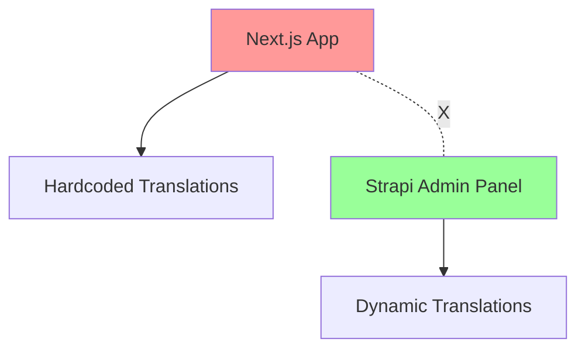
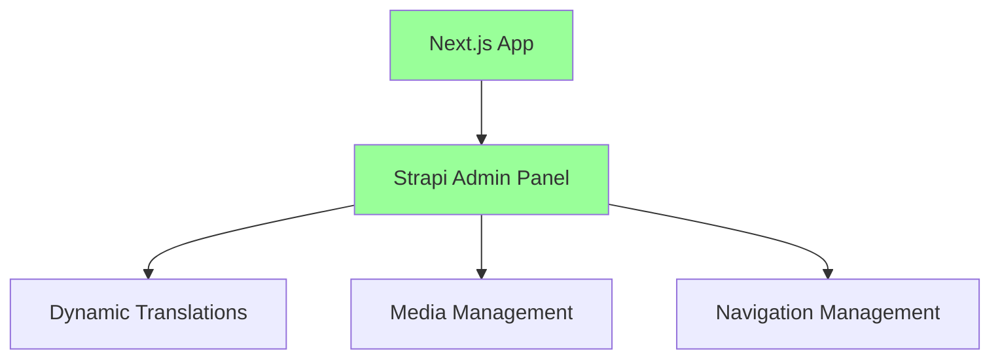

# Strapi Admin Panel Documentation

## Overview

The AiStudio555 AI Academy uses **Strapi v4** as a headless CMS for managing
translations, media content, and other dynamic content through a separate admin
panel project.

## Project Structure

```
Desktop/Projects/schoolSite/
├── aistudio555-academy/          # Main Next.js application
│   ├── apps/web/               # Frontend (port 3000)
│   ├── apps/api/               # Backend API (port 4000)
│   └── docs/                   # Documentation (this file)
└── aiStudion555_adminPanel/    # Strapi Admin Panel Project
    ├── strapi/                 # Strapi installation
    │   ├── config/            # Database, server, admin config
    │   ├── src/api/           # Custom API endpoints
    │   └── public/uploads/    # Media uploads
    └── docs/                   # Strapi setup documentation
```

## Strapi Admin Panel

### Location

**Path:**
`/Users/michaelmishayev/Desktop/Projects/schoolSite/aiStudion555_adminPanel/strapi`

### Access URLs

- **Admin Panel:** http://localhost:1337/admin
- **API Endpoint:** http://localhost:1337/api
- **Content API:** http://localhost:1337/api/translations

### Purpose

The Strapi admin panel serves as the **Content Management System (CMS)** for:

1. **Translation Management** - Manage multi-language content (EN/RU/HE)
2. **Media Management** - Upload and organize images, videos, documents
3. **Navigation Management** - Dynamic menu items and navigation structure
4. **User Management** - Admin users with different permission levels
5. **Content Approval** - Workflow for content review and publication

## Why Menu Text is Currently Hardcoded

**ROOT CAUSE:** The main app (`aistudio555-academy`) is **not yet connected** to
the Strapi admin panel.

### Current State:



### Target State:



## Translation System Architecture

### Content Type Structure

#### Translation Content Type

```javascript
{
  key: "nav.courses",           // Unique translation key
  en: "Courses",               // English text
  ru: "Курсы",                 // Russian text
  he: "קורסים",                // Hebrew text
  category: "navigation",       // Category (navigation, common, etc.)
  description: "Main nav item", // Admin description
  isActive: true               // Enable/disable translations
}
```

#### Media Content Type

```javascript
{
  key: "hero.background",      // Unique media key
  type: "image",              // image, video, document
  source: "upload",           // upload, youtube, external
  url: "/uploads/hero-bg.jpg", // File path or URL
  alternativeText: "Hero background",
  metadata: {
    width: 1920,
    height: 1080,
    format: "jpg"
  },
  page: "home",               // Page association
  section: "hero",            // Section association
  order: 1,                   // Display order
  isActive: true              // Enable/disable media
}
```

### API Integration

#### Custom Endpoints

The Strapi installation includes custom API endpoints:

1. **Sync Translations:** `POST /api/custom/sync-translations`
   - Triggers sync between Strapi and main app
   - Used for bulk translation updates

2. **Process Media:** `POST /api/custom/process-media`
   - Handles media upload and processing
   - Generates responsive image variants

3. **Webhook Handler:** `POST /api/webhooks/strapi`
   - Receives real-time updates from Strapi
   - Invalidates cache and updates content

### Webhook Integration

```javascript
// Strapi Webhook Configuration
{
  name: "Main App Sync",
  url: "http://localhost:3000/api/webhooks/strapi",
  headers: {
    "X-Webhook-Secret": "shared-secret-key"
  },
  events: [
    "entry.create",
    "entry.update",
    "entry.delete",
    "entry.publish",
    "entry.unpublish"
  ]
}
```

## User Roles & Permissions

### SuperAdmin

- **Full access** to all content types
- **System settings** configuration
- **User management** (create/edit/delete users)
- **Plugin management** and configuration
- **Direct publish** without approval

### Admin

- **Create/edit** all content types
- **Publish** with approval workflow
- **Limited user management** (editors only)
- **No system settings** access
- **Media management** with full permissions

### Editor

- **Create/edit** own content only
- **Cannot publish** (requires approval)
- **No user management** access
- **Limited media upload** (size/format restrictions)
- **Content drafts** and revision history

## Content Management Workflow

### Translation Updates

1. **Editor/Admin** logs into Strapi admin panel
2. **Creates/updates** translation entries
3. **Saves as draft** or **publishes** (based on permissions)
4. **Webhook triggers** sync to main application
5. **Main app cache** invalidated and updated
6. **Frontend reflects** new translations immediately

### Media Management

1. **Upload media** through Strapi admin interface
2. **Auto-processing** generates responsive variants
3. **Metadata extraction** and storage
4. **CDN integration** (optional) for performance
5. **Media references** updated across content

## Database Configuration

### PostgreSQL Setup

```javascript
// strapi/config/database.js
{
  client: 'postgres',
  connection: {
    host: 'localhost',
    port: 5432,
    database: 'strapi_admin',
    user: 'aistudio555',
    password: 'yourpassword'
  }
}
```

### Content Tables

- `translations` - Multi-language text content
- `media` - File uploads and external media references
- `navigation_items` - Dynamic menu structure
- `users` - Admin panel users and roles
- `strapi_administrator` - System admin accounts

## Development Workflow

### Starting the Admin Panel

```bash
# Navigate to Strapi directory
cd /Users/michaelmishayev/Desktop/Projects/schoolSite/aiStudion555_adminPanel/strapi

# Development mode (with auto-rebuild)
npm run develop

# Production mode
npm run start
```

### Main App Integration

```bash
# Navigate to main app
cd /Users/michaelmishayev/Desktop/Projects/schoolSite/aistudio555-academy

# Start development servers
pnpm dev  # Starts both web (3000) and api (4000)
```

### Testing Integration

1. **Start Strapi:** http://localhost:1337/admin
2. **Start Main App:** http://localhost:3000
3. **Update translation** in Strapi admin
4. **Verify changes** appear in main app
5. **Check webhook logs** for sync confirmation

## Integration Status

### ✅ Completed

- [x] Strapi v4 installation and configuration
- [x] PostgreSQL database setup
- [x] Content types created (Translation, Media)
- [x] User roles and permissions configured
- [x] Custom API endpoints implemented
- [x] Webhook configuration ready

### ❌ Pending Integration

- [ ] Main app API client for Strapi
- [ ] Webhook handler in main app
- [ ] Translation service refactor
- [ ] Cache management system
- [ ] Error handling and fallbacks
- [ ] Testing and documentation

## Next Steps

### Phase 1: Basic Integration

1. Create Strapi API client in main app
2. Implement webhook handler for real-time updates
3. Refactor `useTranslation` hook to use Strapi data
4. Add fallback to hardcoded translations
5. Test basic translation sync

### Phase 2: Advanced Features

1. Implement caching strategy (Redis/memory)
2. Add translation approval workflow
3. Create media management integration
4. Build admin interface for navigation
5. Add bulk import/export tools

### Phase 3: Production Ready

1. Performance optimization and caching
2. Error handling and monitoring
3. Security hardening and access controls
4. Backup and recovery procedures
5. Documentation and user training

## Troubleshooting

### Common Issues

#### Admin Panel Not Loading

```bash
# Check if Strapi is running
ps aux | grep strapi

# Restart Strapi
cd aiStudion555_adminPanel/strapi
npm run develop
```

#### Database Connection Issues

```bash
# Check PostgreSQL status
brew services list | grep postgresql

# Test database connection
psql -h localhost -U aistudio555 -d strapi_admin
```

#### Translation Sync Issues

1. Verify webhook URL is accessible from Strapi
2. Check webhook secret matches in both apps
3. Review webhook logs in Strapi admin panel
4. Test API endpoints manually with Postman

## Documentation Links

- **Strapi Setup Guide:** `aiStudion555_adminPanel/docs/strapi-setup.md`
- **Main App Documentation:** `aistudio555-academy/CLAUDE.md`
- **Database Schema:** `docs/architecture/db/`
- **API Documentation:** `docs/API-ARCHITECTURE.md`

## Support

For issues or questions regarding the admin panel:

1. Check the troubleshooting section above
2. Review Strapi logs: `strapi/logs/`
3. Check main app webhook handler logs
4. Verify database connectivity and permissions
5. Consult official Strapi documentation: https://docs.strapi.io/
